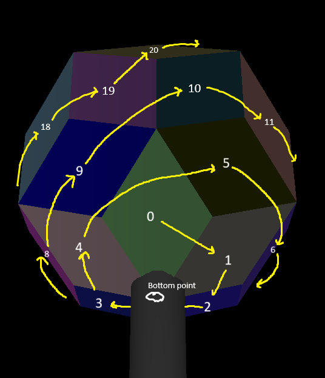
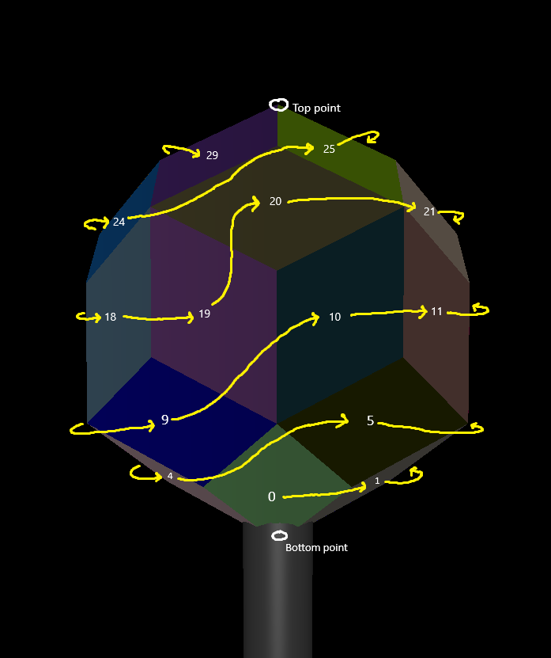
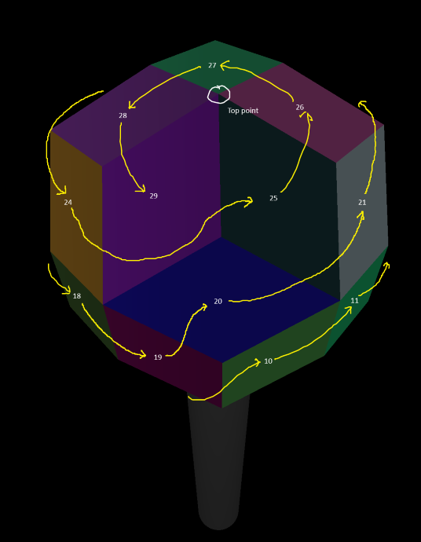

# Flamatik

This is the program to run the LightCurve structure, including a rich set of patterns. 
It was originally a test framework, then it grew up.

It interacts directly with the controllers. There are 3 esp32 based controllers, each
with 10 flame jets.

It also can be used with the simulator.

# use

## installation

Install a recent python. Tested with 3.12.

Install the necessary python packages. `pip install -r requirements.txt`

On windows, you may need to required the C++ build tools in order to get the tools `netifaces` requires. This can be done through `choco install visualcpp-build-tools` or by installing Visual Studio Code, and installing the C++ package, and correctly adding to path.

# Patterns

The pattern code is written in python. The code is written to python 3.10-ish which is common
around the time we are writing.

To add a new pattern, copy one of the files such as `pattern_pulse.py` to a new file.
Change the name of the single function `def pattern_pulse` to the same name as the file.
All else should be pretty obvious.

Change the pattern to so what you'd like. Use delays or time to update the array of `solinoid` and `aperture`.

There are a set of helper geometry files such as `face_groupings.py` and `geometry_math.py` . They
contain vectors and location information for the nozzels in lightcurve.

# Mapping and configuration of nozzles

The configuration file specifies what controller boards exist, how many nozzels they have, for outputting the right ArtNet.

When writing a pattern, write using the "mapped" version of LightCurve,
where the nozzels go around in a circle and from the bottom to the top.

In the config file, there is a mapping from the nozzels and solenoids as they
are on the sculpture - which is randomly connected - to the abstract pattern version.

For example, if controller "1" solenoid wire "1" goes to nozzle "8" in the
sculpture, place the number "8" in the correct slot in the `solenoid_map`
position 1 in the config file.

The wiring for solenoids and servos is different, even though a given physical solenoid and servo goes to the same nozzle.

Therefore, there is also an `aperture_map` which is different.

# Aperture ( servo ) calibration

Pattern developers use 0.0 and 1.0 for each nozzel to represent how much they want the needle valve to be open.

The values sent over ArtNet to the controller are 0 ... 255 . They are converted to PWM values for the servos. 

There isn't a huge amount of resolution in the physical system, maybe about 100 steps.

Each servo and needle valve head is slightly different. Therefore "full off" might be 0, or it might be 5, or it might be 10. It's
pretty important to get these values right, to avoid jamming the servo and causing failure.

This calibration is done in `flamatik` . There is a configuration table that maps the abstract range to the physical range.

The table in the configuration file is called `aperture_calibration` . ** It has a tuple which is the start and stop range. ** These are represented
as `float` (although more properly they might be `int`).

The start value is the lowest value the program will emit over artnet for this nozzle. The end value is the highest value.

## Example

The physical nozzle on the sculpture is nozzel 7 . 

The entry in the `aperture_calibration` table is: "7": [ 5.0, 100.0 ] 

The controller's `aperture_map` shows that nozzel 7 is located on board 2, in the 4th position. This is found
by reading through the controllers and finding where the value 7 is located.

Therefore, the pattern developer puts a value like 0.5 for nozzel 7.

`flamatik` normalizes 0.5 , which means half way between 5.0 and 100.0, to 52.5, and rounds down to 52.

Then when the `flamatik` code is outputting values to board 2, it finds the 4th value in the output
ArtNet fixture configuration is nozzle 7 , so it places the value 52 in the 8th byte (because solenoids and apertures are interleaved). 

# The off state

We considered, at one point, that turning the aperture off, and the solnoid on, we should probably also turn the solinoid off, to avoid leakage etc.

This code was removed for a bit, it might come back.

# Nozzle Locations and Mapping

Here's how we identify individual faces within the rhombic triacontahedron. First a textual explanation then images.

- The triacontahedron is oriented with a 5-sided vertex at the top and bottom.
- The "front" of the triacontahedron is such that you are in line with one of the 5 downard facing nozzles, i.e. a nozzle is shooting toward your feet (as opposed to between 2 of those nozzles).
- The order goes through goes through 5 different "rings" of faces, each on the same horizontal level, which are as follows:
  - Indices 0-4: The five faces forming a pentagonal pyramid facing downward.
  - Indices 5-9: The five faces facing diagonal-downward just above the first pyramid.
  - Indices 10-19: The ten faces going all around the center of the triacontahedron forming a horizontal ring facing outwards.
  - Indices 20-24: five faces facing diagonal-upward just above the ring of 10.
  - Indices 25-29: The five faces forming a pentagonal pyramid facing upward.
- Within each ring, the order is clockwise if you are on the ground facing up at the triacontahedron, or counter-clockwise if you are in the sky facing down on the triacontahedron.
- The first face within each ring is the one facing directly toward you (if there is one) or the one just to the right of center (if there isn't one facing toward you).

In these images, the gray cylinder represents the shaft attaching the star to the rest of the sculpture. The colors of the faces are random, only to help see the division between faces, and not necessarily the same across these screenshots unfortunately.

|Bottom view|Front view|Top view|
|:----:|:----:|:----:|
|  |  |  |
