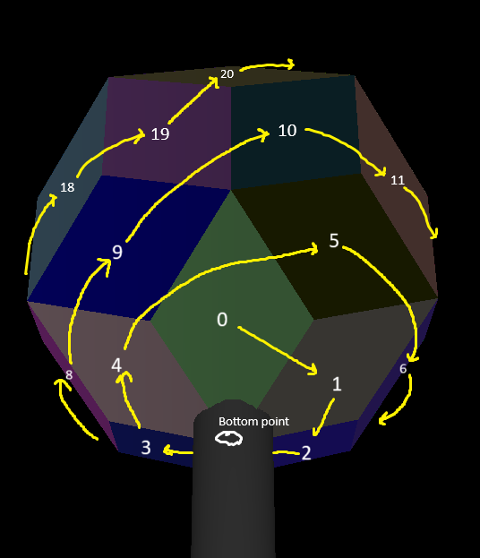
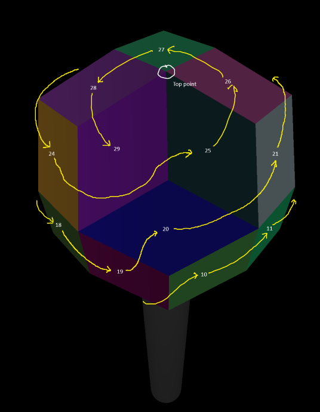

# Flame Test

This directory has basic test patterns for Light Curve.

It interacts directly with the controllers. There are 3 esp32 based controllers, each
with 10 flame jets.

It also can be used with the simulator.

# use

## installation

Install a recent python. Tested with 3.12.

Install the necessary python packages. `pip install -r requirements.txt`

On windows, you may need to required the C++ build tools in order to get the tools `netifaces` requires. This can be done through `choco install visualcpp-build-tools` or by installing Visual Studio Code, and installing the C++ package, and correctly adding to path.

# Art Net Definition

Each controller expresses 10 devices, which in ArtNet terms are Fixtures.

Each controller is at a single IP address, therefore, there are 3.

Each fixture has two channels.

The first channel is "solonoid", which is 1 (on) or 0 (off).

The second channel is "aperture", which controls the flow. This value is from 0 (off) to 255 (full on).

Note that there are two ways to express "off". Thus is is possible to have the valve full open but the solonoid off, and the solonoid on but the valve is off. This is _intentional_ because we wish to support "poofs", that is, having the valve wide open and turning the solonoid open.

Therefore, an artnet packet will generally have 20 channels - 2 bytes for each fixture, 10 fixtures, in order.

The solonoids are in a particular order, which will be described in another document.

Artnet packets are _directed_, because we are worried about these embedded systems not playing nice with broadcast IP packets.

Q: The sequence number _is_ used. The ArtNet is flowing over wifi, which has a greater chance of inverting packet order.

Q: ArtNet has a discover protocol. This doesn't use them.

# Patterns

The test code is written in python. The code is written to python 3.10-ish which is common
around the time we are writing.

To add a new test pattern, copy one of the files such as `pattern_pulse.py` to a new file.
Change the name of the single function `def pattern_pulse` to the same name as the file.

Change the pattern to so what you'd like. Use delays or time to update the array of `solinoid` and `aperture`.

# Mapping and configuration

The configuration file specifies what controller boards exist, how many nozzels they have, for outputting the right ArtNet.

When writing a pattern, write using the "mapped" version of LightCurve,
where the nozzels go around in a circle and from the bottom to the top.

In the config file, there is a mapping from the nozzels and solenoids as they
are on the sculpture - which is randomly connected - to the abstract pattern version.

For example, if controller "1" solenoid "1" actually maps to solenoid "8" in the
abstract version, place the number "8" in the correct slot in the "solenoid_map"
position 1 in the config file.

# The off state

Since the calibration is not yet perfect, there is a small bit of code that also turns the solenoid off for a small aperture. This value can be played with, or eventually removed,
if the calibration is better or if the controller software takes on this capability.

In the case of using the simulator, this filter creates an unusual effect. Instead of seeing the value decrease , there is a crisp shutoff when you are still asking for flow.

# The on state

Because an HSI is used, there is a small period of time after opening the aperture or solinoid before it lights. The currently observed value is much less than a second, but it does exist. We expect this value to get smaller.

# Nozzle Mapping

Here's how we identify individual faces within the rhombic triacontahedron. First a textual explanation then images.

- The triacontahedron is oriented with a 5-sided vertex at the top and bottom.
- The "front" of the triacontahedron is such that you are in line with one of the 5 downard facing nozzles, i.e. a nozzle is shooting toward your feet (as opposed to between 2 of those nozzles).
- The order goes through goes through 5 different "rings" of faces, each on the same horizontal level, which are as follows:
  - Indices 0-4: The five faces forming a pentagonal pyramid facing downward.
  - Indices 5-9: The five faces facing diagonal-downward just above the first pyramid.
  - Indices 10-19: The ten faces going all around the center of the triacontahedron forming a horizontal ring facing outwards.
  - Indices 20-24: five faces facing diagonal-upward just above the ring of 10.
  - Indices 25-29: The five faces forming a pentagonal pyramid facing upward.
- Within each ring, the order is clockwise if you are on the ground facing up at the triacontahedron, or counter-clockwise if you are in the sky facing down on the triacontahedron.
- The first face within each ring is the one facing directly toward you (if there is one) or the one just to the right of center (if there isn't one facing toward you).

In these images, the gray cylinder represents the shaft attaching the star to the rest of the sculpture. The colors of the faces are random, only to help see the division between faces, and not necessarily the same across these screenshots unfortunately.
|Bottom view|Front view|Top view|
|:----:|:----:|:----:|
|  |  |  |
